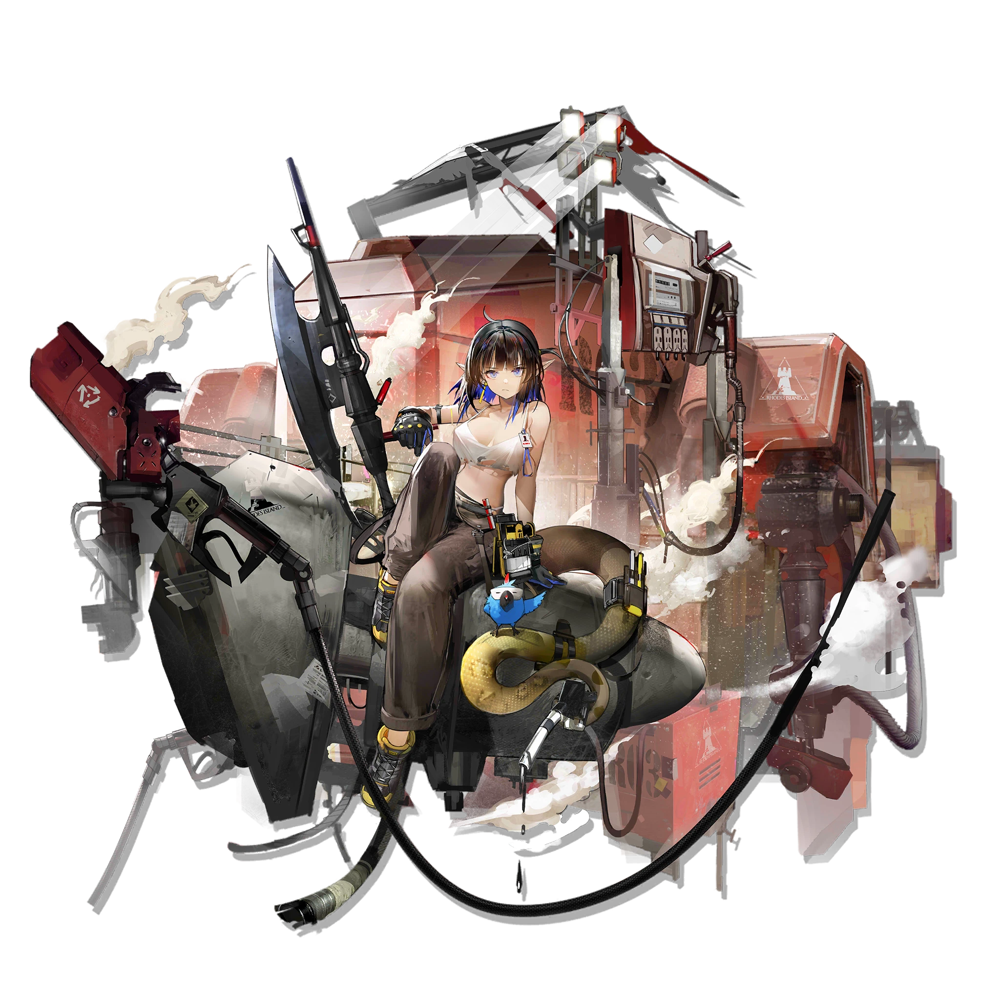

[)](https://www.zhihu.com/people/styx-q)

[)](https://space.bilibili.com/32303300)

[)](https://www.artstation.com/unimend)

<h1 align="center">Hi 👋, I'm Unimend</h1>
<h3 align="center">A passionate frontend developer from India</h3>

  

<h3 align="left">Connect with me:</h3>

<h3 align="left">Languages and Tools:</h3>

    

